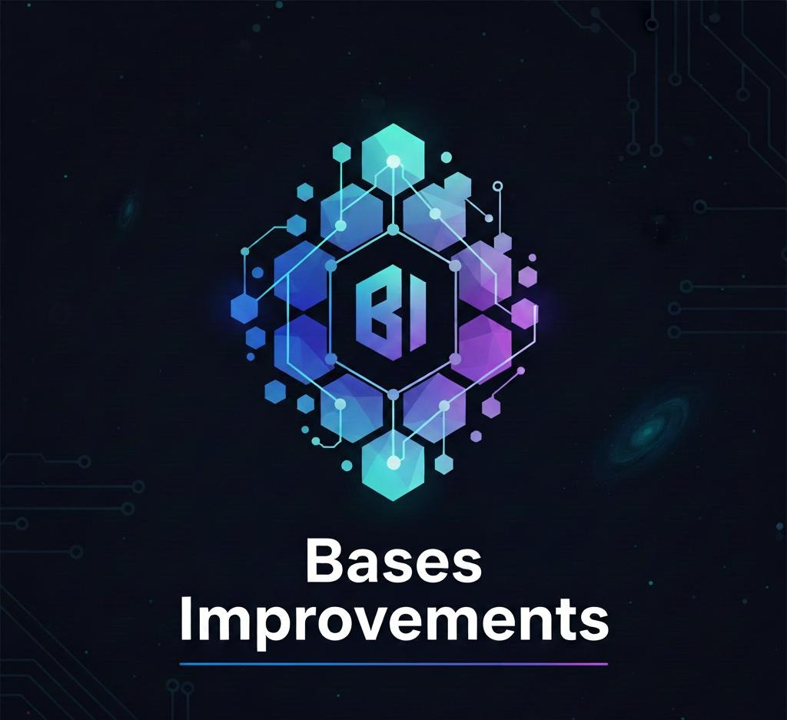

<div align="center">



# Bases Improvements


**Supercharge your Obsidian Bases workflow with dynamic search filtering — filter any base query instantly**

---

## 🎥 Quick Tutorial

Watch this quick video tutorial to see Bases Improvements in action:

<div align="center">
  <iframe
    width="315"
    height="560"
    src="https://www.youtube.com/embed/vqOCACgueKU"
    title="Bases Improvements Tutorial"
    frameborder="0"
    allow="accelerometer; autoplay; clipboard-write; encrypted-media; gyroscope; picture-in-picture; web-share"
    allowfullscreen>
  </iframe>
</div>

**[Watch on YouTube](https://www.youtube.com/shorts/vqOCACgueKU)**

</div>

---

## 📚 Documentation

**[View Full Documentation →](https://real1tyy.github.io/BasesImprovements/)**

Quick Links:
- [Installation](https://real1tyy.github.io/BasesImprovements/installation) • [Quickstart](https://real1tyy.github.io/BasesImprovements/quickstart) • [Configuration](https://real1tyy.github.io/BasesImprovements/configuration)
- [Features Overview](https://real1tyy.github.io/BasesImprovements/features/overview) • [FAQ](https://real1tyy.github.io/BasesImprovements/faq) • [Troubleshooting](https://real1tyy.github.io/BasesImprovements/troubleshooting)

---

## 📦 Installation

Bases Improvements is currently **awaiting approval** for the Obsidian Community Plugin store. In the meantime, you can install it using one of these methods:

### 🎯 Recommended: BRAT (Beta Reviewers Auto-update Tool)

The easiest way to install and keep Bases Improvements up to date:

1. Install the [BRAT plugin](https://github.com/TfTHacker/obsidian42-brat) from Obsidian's Community Plugins
2. Open BRAT settings (Settings → BRAT)
3. Click **Add Beta Plugin**
4. Enter this repository URL: `https://github.com/Real1tyy/BasesImprovements`
5. Click **Add Plugin**
6. Enable Bases Improvements in Settings → Community Plugins

**Benefits**: Automatic updates, smooth experience, one-click installation

### 📥 Manual Installation from GitHub Releases

1. Go to [Releases](https://github.com/Real1tyy/BasesImprovements/releases)
2. Download the latest release assets:
   - `main.js`
   - `manifest.json`
   - `styles.css`
3. Create folder: `{VaultFolder}/.obsidian/plugins/bases-improvements/`
4. Move downloaded files into the folder
5. Reload Obsidian (Ctrl/Cmd + R)
6. Enable Bases Improvements in Settings → Community Plugins

**Note**: All releases are versioned and tagged for easy reference.

### ✨ Coming Soon

Once approved for the Community Plugin store, you'll be able to install Bases Improvements directly from Settings → Community Plugins → Browse.

---

## 🎯 What Does It Do?

Bases Improvements automatically injects a **search input field** above every `base` code block in your notes. As you type, the plugin dynamically updates the base block content to include a `file.name.contains("value")` filter, making it easy to search and filter your query results on the fly.

## ✨ Key Features

- **🔍 Dynamic Search Filtering** - Live search input injected above base blocks
- **📝 Smart Filter Injection** - Intelligently adds filters to existing WHERE clauses
- **🔗 Embed Support** - Works with both inline blocks and embedded `.base` files
- **⚡ Debounced Input** - Configurable debouncing prevents excessive updates
- **🎨 Clean UI** - Styled search inputs that integrate seamlessly with Obsidian
- **⚙️ Highly Configurable** - Customize code fence language, debounce timing, and more

## 🚀 Quick Example

### Before Typing

````markdown
```base
FROM notes
SELECT title, date
```
````

### After Typing "meeting"

````markdown
```base
FROM notes
WHERE file.name.contains("meeting")
SELECT title, date
```
````

The filter is automatically injected and your base query updates in real-time!

## 🎬 How It Works

1. **Detects Base Blocks** - Scans your active note for code blocks with the configured language (default: `base`)
2. **Injects Search Input** - Renders a styled search input above each detected block
3. **Live Updates** - As you type, the filter is automatically added or updated in the base block
4. **Smart Filtering** - Handles existing WHERE clauses by appending with AND logic

---

## 🔧 **Requirements**

- **Obsidian**: 1.4.16 or higher
- **Bases Plugin**: Required for base blocks to actually query your vault

---

## 💡 **Use Cases**

- **Quick note filtering** - Instantly filter notes by name without modifying your base query
- **Exploratory queries** - Test different search terms without manually editing code blocks
- **Embedded queries** - Filter embedded `.base` files just as easily as inline blocks
- **Rapid prototyping** - Quickly iterate on query filters during note creation
- **Research workflows** - Dynamically narrow down results while exploring your vault
- **Project management** - Filter project notes on the fly during sprint planning

---

## 🛠️ **Development**

### Build Commands

- `pnpm dev` - Development build with hot reload
- `pnpm build` - Production build
- `pnpm typecheck` - Type checking
- `pnpm check:fix` - Run Biome linting and formatting
- `pnpm test` - Run test suite

### Code Quality

This project uses:
- **Biome** for linting and formatting
- **TypeScript** for type safety
- **ESBuild** for fast builds
- **Vitest** for testing

### Architecture

Clean component-based architecture:

- **`BaseFilterInput`** - Reusable component that handles input rendering, debouncing, and events
- **`BasesImprovementsPlugin`** - Main plugin class that manages component lifecycle and base block detection
- **Event-driven updates** - Listens to workspace changes to dynamically update filters

---

## Support & Sponsorship

If you find Bases Improvements useful and want to support its ongoing development, please consider becoming a sponsor. Your contribution helps ensure continuous maintenance, bug fixes, and the introduction of new features.

- [Support My Work](https://github.com/Real1tyy#-support-my-work)

Every contribution, no matter the size, is greatly appreciated!

---

## Contributing

MIT-licensed. PRs welcome!

---

## Credits & Acknowledgments

Bases Improvements enhances the [Obsidian Bases plugin](https://help.obsidian.md/bases) workflow. We're grateful to the Obsidian team for creating such a powerful querying system that makes this plugin possible.

---

<div align="center">

**Made with ❤️ by Real1tyy**

[⭐ Star this repo](https://github.com/Real1tyy/BasesImprovements) • [🐛 Report a bug](https://github.com/Real1tyy/BasesImprovements/issues) • [💡 Request a feature](https://github.com/Real1tyy/BasesImprovements/issues)

</div>
